# 🚗 Electronic Follow-Up

This is a practical mobile application built using **FlutterFlow** to help users monitor their vehicles in real time. The system connects to a chip installed in the car, which collects data (like engine status, mileage, etc.) and sends it to the app through service providers.

The app features a clear, user-friendly interface and includes a dashboard, detailed vehicle information, alerts, search & filtering options, user access control, and comprehensive reports.

---

## 💡 What It Does

- Tracks vehicle status (e.g., engine health, mileage)  
- Sends real-time alerts and notifications  
- Displays detailed car and maintenance information  
- Allows filtering and searching through data  
- Provides reports for better vehicle management  
- Supports multiple users with controlled access  

---

## 💻 How It Works

1. **Install a chip in the vehicle**  
   The chip reads essential data and sends it to the app.

2. **Login to the mobile app**  
   Users can sign in securely to access their vehicle info.

3. **Dashboard overview**  
   View real-time data, active alerts, and quick access to key information.

4. **Search and filter**  
   Easily filter vehicles or issues based on various criteria.

5. **Reports and notifications**  
   Access periodic reports and receive push notifications.

---

## ✨ Features

- Real-time vehicle monitoring  
- Push notifications for urgent issues  
- Dark mode support  
- Multi-user access  
- Dashboard with quick stats  
- Exportable reports  
- Built entirely with **FlutterFlow**  

---

## 🛠️ Built With

- **FlutterFlow** – No-code platform for building Flutter apps  
- **Firebase** – For authentication, database, and cloud functions  
- **REST APIs** – To fetch external vehicle data  
- **Custom Widgets** – For advanced UI/UX  
- **Google Maps** – (optional) for location tracking  

---

## 🖼️ Screenshots

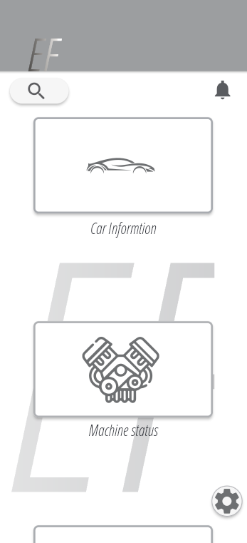  
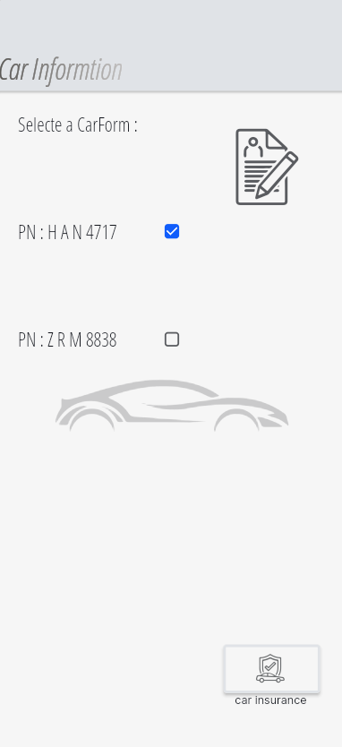  
  
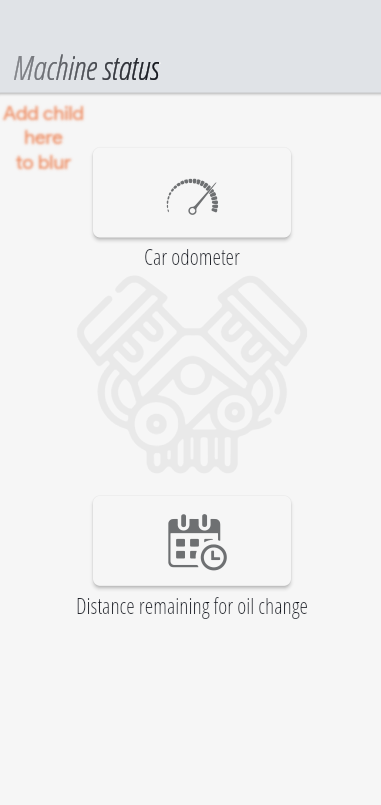  
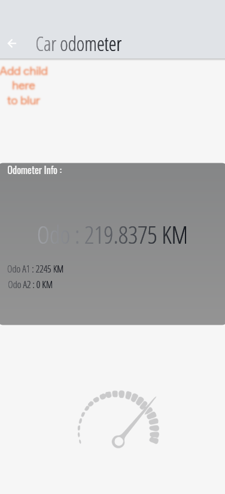  
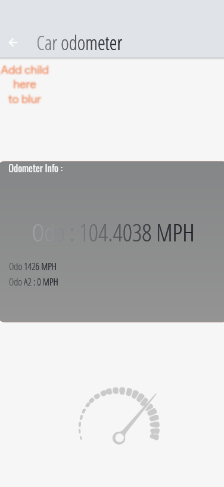  
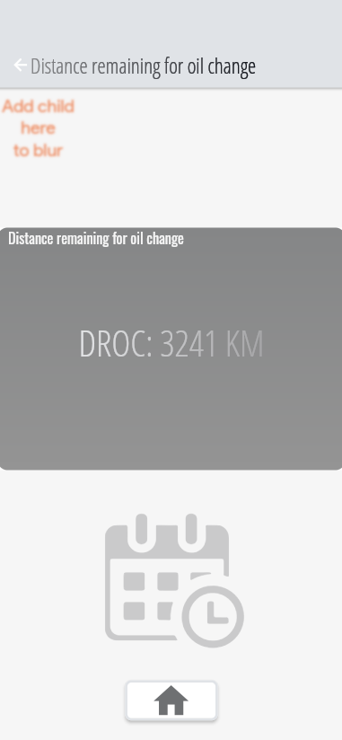  
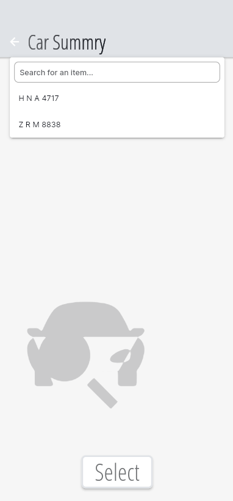  
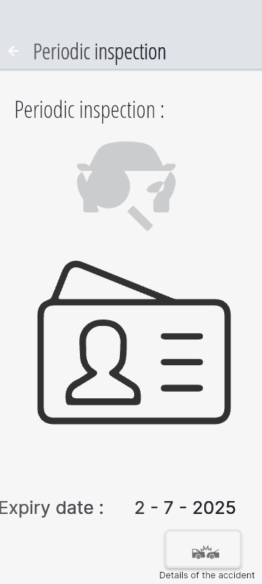  
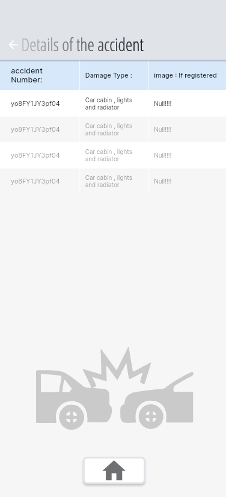  
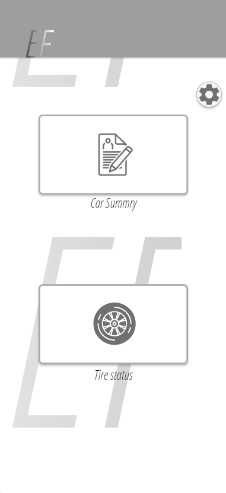  
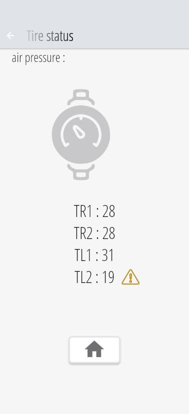  
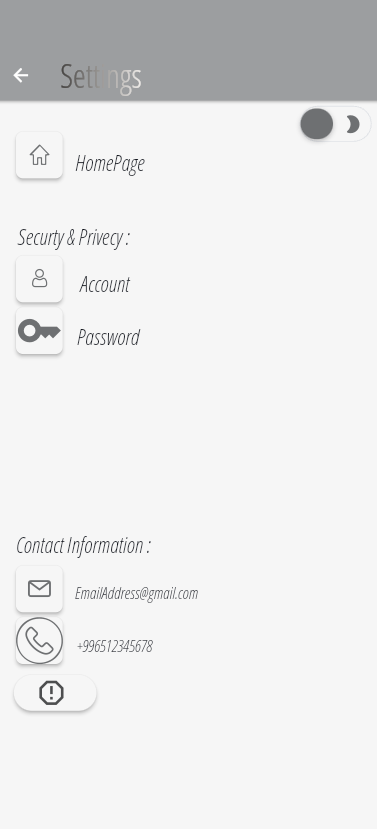  
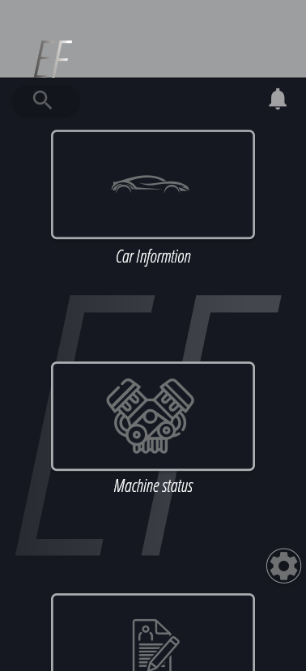  
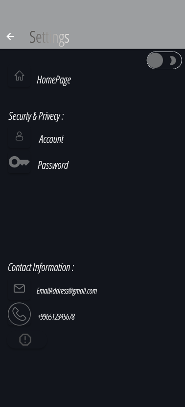  

---

## 🚀 How to Run

1. Go to [FlutterFlow.io](https://flutterflow.io) and log in  
2. Import the project using the `.ff` project file (if available) or rebuild the UI manually  
3. Connect your Firebase project for backend integration  
4. Set up APIs or environment variables if needed  
5. Run and test the app using FlutterFlow’s preview or export to mobile

---

## 📂 Project Files

- All UI and logic built using **FlutterFlow**  
- Screenshots and app presentation included  
- Project pitch deck: `Elecronic Follow Up Presentation.pptx`

